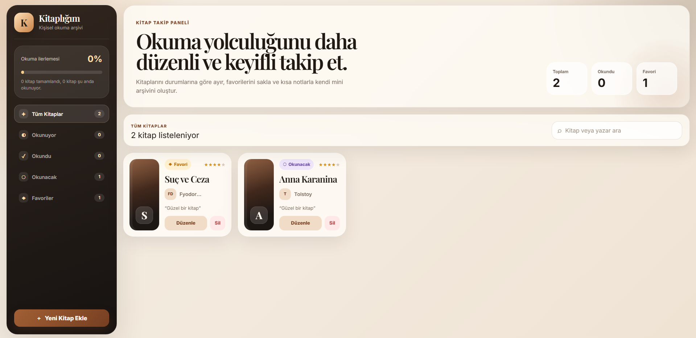
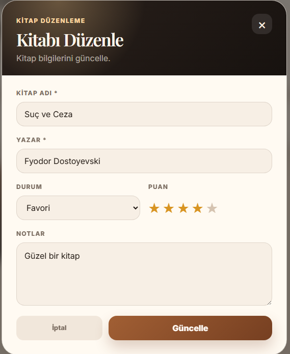
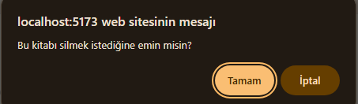

# Book Tracker App - Kitap Takip Uygulaması

Book Tracker App, kullanıcıların kişisel okuma arşivlerini oluşturabilmesi için geliştirilmiş modern bir kitap takip uygulamasıdır. Kullanıcılar kitap ekleyebilir, kitaplarını listeleyebilir, mevcut kitap bilgilerini güncelleyebilir, kitap silebilir ve okuma durumlarına göre filtreleme yapabilir.

Bu proje, Web Geliştirme / JavaScript eğitim projesi kapsamında ReactJS kullanılarak hazırlanmıştır.

## Proje Amacı

Bu projenin amacı; HTML, CSS, JavaScript ve modern JavaScript kütüphanelerinden ReactJS kullanarak gerçek bir frontend uygulaması geliştirmektir. Uygulamada CRUD işlemleri, component yapısı, state yönetimi, localStorage kullanımı ve responsive tasarım mantığı uygulanmıştır.

## Kullanılan Teknolojiler

- ReactJS
- TypeScript
- Vite
- Tailwind CSS
- CSS
- LocalStorage
- Git / GitHub

## Özellikler

- Kitap ekleme
- Kitap listeleme
- Kitap güncelleme
- Kitap silme
- Kitap arama
- Okuma durumuna göre filtreleme
- Favori kitap işaretleme
- Kitap puanlama
- Kitap notu ekleme
- LocalStorage ile veri saklama
- Responsive modern arayüz

## Proje Klasör Yapısı

```text
book-tracker-app/
├── public/
│   └── screenshots/
│       ├── home.png
│       ├── edit-book.png
│       ├── delete-confirm.png
│       └── empty-state.png
├── src/
│   ├── components/
│   │   ├── BookCard.tsx
│   │   └── BookModal.tsx
│   ├── context/
│   │   └── BookContext.tsx
│   ├── interfaces/
│   │   └── book.ts
│   ├── pages/
│   │   └── BookListPage.tsx
│   ├── App.tsx
│   ├── main.tsx
│   └── index.css
├── package.json
├── vite.config.ts
└── README.md
```

## CRUD İşlemleri

### Ekleme

Kullanıcı yeni kitap ekleme formu üzerinden kitap adı, yazar, durum, puan ve not bilgilerini girerek yeni kitap oluşturabilir.

### Listeleme

Eklenen kitaplar ana sayfada kart yapısı ile listelenir. Kitapların durumları, favori bilgisi, puanı ve kısa notları görüntülenebilir.

### Güncelleme

Kullanıcı mevcut bir kitabın bilgilerini düzenleme modalı üzerinden güncelleyebilir.

### Silme

Kullanıcı seçtiği kitabı onay ekranı ile silebilir. Silinen kitap localStorage üzerinden de kaldırılır.

## LocalStorage Kullanımı

Projede veriler tarayıcının localStorage alanında saklanmaktadır. Böylece sayfa yenilense bile kullanıcının eklediği kitaplar korunur.

## Proje Ekran Görüntüleri

### Ana Sayfa



### Kitap Düzenleme



### Silme Onayı



### Boş Liste Ekranı


## Kurulum

Projeyi bilgisayarınıza indirdikten sonra aşağıdaki adımları takip edebilirsiniz.

```bash
npm install
```

Projeyi geliştirme ortamında çalıştırmak için:

```bash
npm run dev
```

Production build almak için:

```bash
npm run build
```

Build önizlemesi için:

```bash
npm run preview
```

## GitHub Linki

Proje GitHub linki:

```text
GitHub linki buraya eklenecek.
```

## Canlı Demo

Netlify veya Vercel canlı demo linki:

```text
Canlı demo linki buraya eklenecek.
```

## Proje Çıktıları

Bu proje ile;

- HTML temelleri uygulanmıştır.
- CSS ve Tailwind CSS kullanılarak modern arayüz geliştirilmiştir.
- JavaScript ve ReactJS temelleri uygulanmıştır.
- Component tabanlı frontend geliştirme yapılmıştır.
- LocalStorage ile veri saklama işlemi gerçekleştirilmiştir.
- CRUD işlemleri uygulanmıştır.
- GitHub üzerinden proje paylaşımı için uygun yapı hazırlanmıştır.
- Netlify veya Vercel ile yayına alınabilir bir frontend projesi oluşturulmuştur.

## Geliştirici

Ahmet Yaşar
